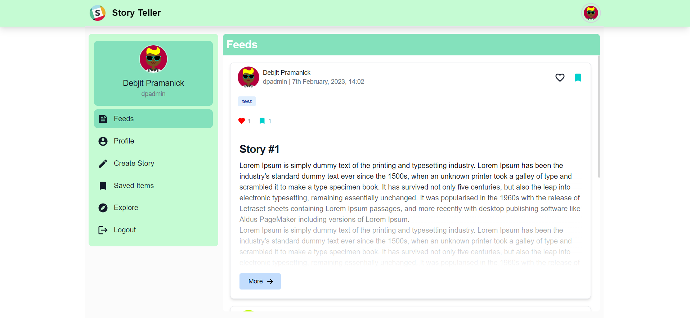
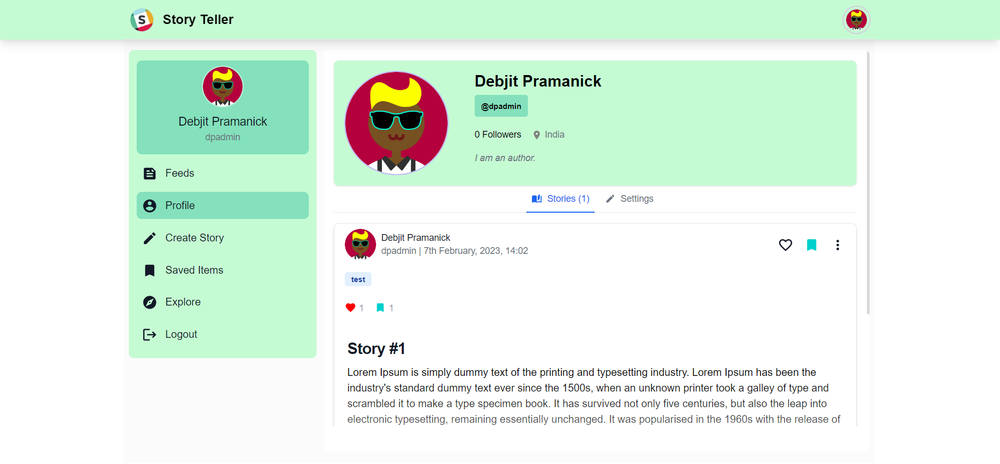
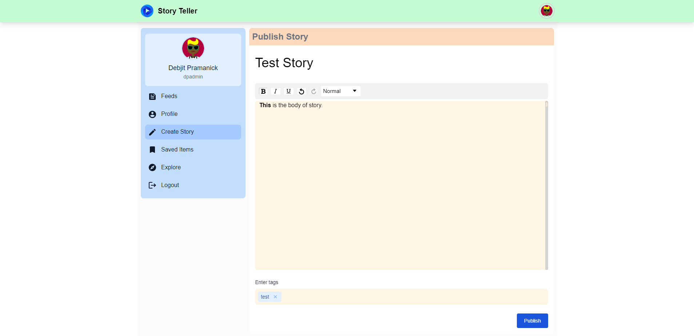
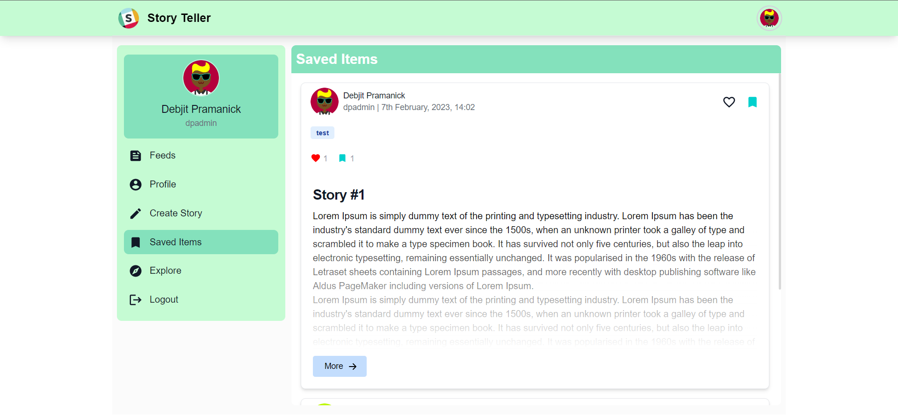
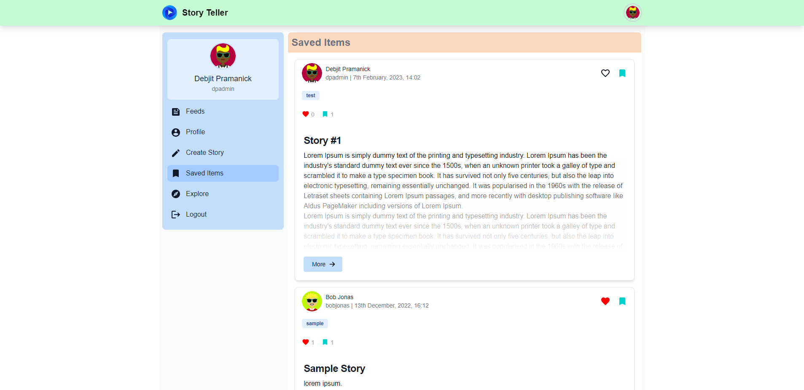
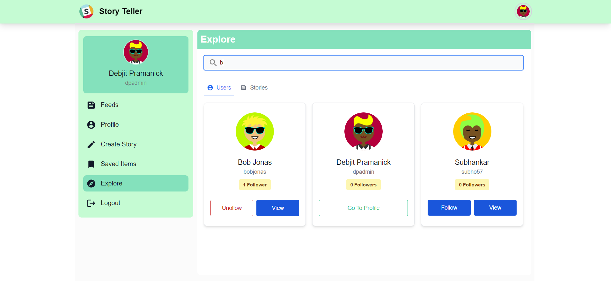

<h1 align="center">StoryTeller - Publish Stories</h1>
  <p align="center">
    A web platform for authors to write  stories and publish. <br />
    <a href="https://hotel-booking-app-2022.netlify.app/">Live Site</a>
    .
    <a href="https://github.com/DebjitPramanick/Hotel-Booking-Web-App/issues">Report Bug</a>
    ·
    <a href="https://github.com/DebjitPramanick/Hotel-Booking-Web-App/issues">Request Feature</a>
  </p>
</p>


<!-- TABLE OF CONTENTS -->
<details open="open">
  <summary>Table of Contents</summary>
  <ol>
    <li>
      <a href="#about-the-project">About The Project</a>
      <ul>
        <li><a href="#built-with">Built With</a></li>
      </ul>
    </li>
    <li>
      <a href="#getting-started">Getting Started</a>
      <ul>
        <li><a href="#prerequisites">Prerequisites</a></li>
        <li><a href="#installation">Installation</a></li>
      </ul>
    </li>
    <li><a href="#roadmap">Roadmap</a></li>
    <li><a href="#contributing">Contributing</a></li>
    <li><a href="#contact">Contact</a></li>  </ol>
</details>


<!-- ABOUT THE PROJECT -->
## About The Project


<br>

Web platform for authors to write stories and publish them. Other users can like or save the story. Also users can follow each other.
Authors can modify the stories also after uploading.

### Built With
* [React-TypeScript](https://reactjs.org/)
* [Flowbite](https://flowbite.com/)
* [Golang](https://go.dev/)
* [MongoDB](https://www.mongodb.com/)


<!-- GETTING STARTED -->
## Getting Started

To get a local copy up and running follow these simple example steps.

### Prerequisites

These things must be installed in your system.
* [NPM](https://nodejs.org/en/)
* [Golang](https://go.dev/)

### Installation

1. Clone the repo
   ```sh
   git clone https://github.com/DebjitPramanick/StoryTeller.git
   ```
2. Open the project folder
4. Now open MongoDB
5. Create a database collection
6. Copy connection url
7. Now run
   ```sh
   cd server
   ```
8. Create .env file
9. Paste the connection url of DB with key name = MONGO_URL and the database name with key = DB_NAME
10. Now run commands
    ```sh
    go get
    go run main.go
    ```
11. Now open new terminal
12. Now run commands
    ```sh
    cd client
    npm i
    npm start
    ```
   
<!-- USAGE EXAMPLES -->
## Usage

Here are some examples of how my application works.
<br>

<br>

<br>

<br>

<br>

<br>

<!-- ROADMAP -->
## Roadmap

See the [open issues](https://github.com/DebjitPramanick/StoryTeller/issues) for a list of proposed features (and known issues).


<!-- CONTRIBUTING -->
## Contributing

Contributions are what make the open source community such an amazing place to be learn, inspire, and create. Any contributions you make are **greatly appreciated**.

1. Fork the Project
2. Create your Feature Branch (`git checkout -b feature/AmazingFeature`)
3. Commit your Changes (`git commit -m 'Add some AmazingFeature'`)
4. Push to the Branch (`git push origin feature/AmazingFeature`)
5. Open a Pull Request


<!-- CONTACT -->
## Contact

Twitter - [@debjitpmk](https://twitter.com/debjitpmk)<br/> 
LinkedIn - [Debjit Pramanick](https://www.linkedin.com/in/debjit-pramanick-7a6a971b1/)<br/> 
Project Link: [https://github.com/DebjitPramanick/Hotel-Booking-Web-App](https://github.com/DebjitPramanick/Hotel-Booking-Web-App)